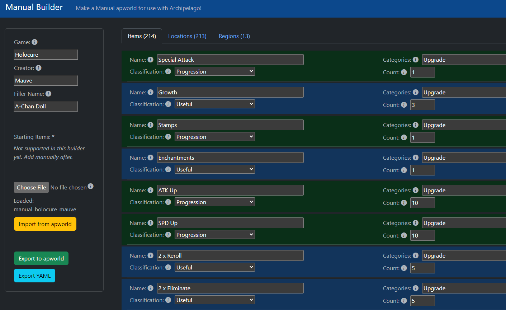

# Manual Builder
We get that the syntax for making a Manual world can be a bit daunting... so we've made a tool to get you started easier!

The Manual Builder is a web-based tool that lets you add lists of items and locations for your game in plain text. It also includes a number of helpful tooltips to explain what the options in the tool are used for.

You can find the Manual Builder here: https://manualforarchipelago.github.io/ManualBuilder/

The Builder tends to lag behind official features a bit so, once you're nicely acclimated to the Manual world creation process, you'll want to take a look at our [Syntax Reference and Examples](../README.md#syntax-reference-and-examples) section for next steps!

## Reporting Bugs or Requesting Features
If you encounter any bugs with the Builder, be sure to let us know in the [official Manual Discord](https://discord.gg/T5bcsVHByx) in the #manual-support channel!

If there are any features you'd like to see in the Builder, hop into that same Discord above and tell us about your desired feature in the #feature-suggestions forum there!
