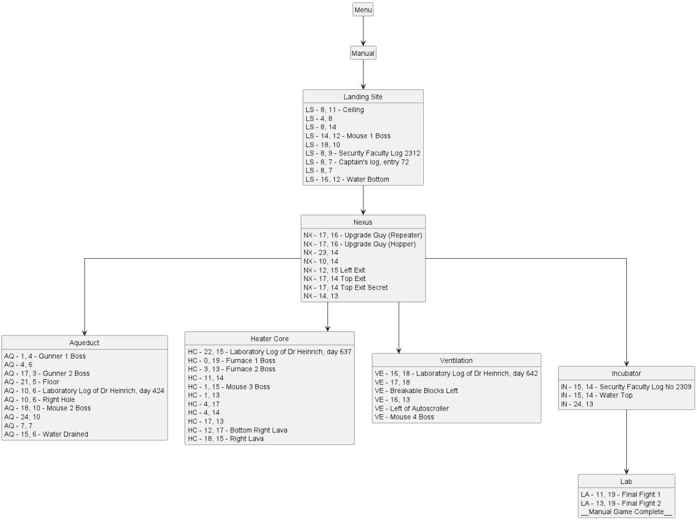

# Visualizing Your World Logic

## Visualizing Regions as a UML Diagram
There's a wonderful tool in Archipelago (written by el_) that allows viewing all of your region connections visually as a diagram! Manual doesn't officially have a way to use this tool yet, but we hope to one day!

(To make use of this feature, you'll want to get a UML viewer like PlantUML.)

Until Manual officially supports using it, there's a workaround to use it if you don't mind looking at a tiny amount of code:

1. Extract/unzip your apworld into a folder in your worlds folder, as if you were going to make changes to it.
2. Open the `__init__.py` file that's in the main folder (not the `hooks` folder).
3. Search for the text `visualize_regions`.
4. Remove the `#` from the front of the two lines that match to uncomment them.
5. Save the `__init__.py` and generate your world! 
6. Open the .puml file that gets generated in your Archipelago folder. It will have the same name as your apworld.

## Organizing Connected Ideas on a Graph
Some tools can help with visualizing your game's structure.
https://csacademy.com/app/graph_editor/ allows you to make a node graph that you can use to represent aspects of your logic.
